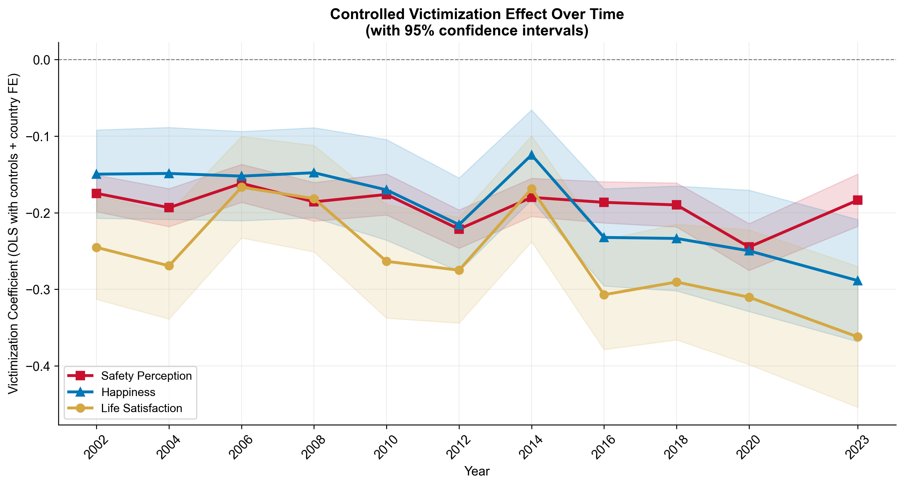

# The Shadow of Crime

### Replication code for the published research article

**Kimberly Bertoli & Emiliano Sironi**

**The Shadow of Crime: The Effect of Victimization on Perceived Safety and Subjective Well-Being in Europe (2002–2023)**

Published in *Peace Economics, Peace Science and Public Policy* (2026).

[Read the published paper](shadow_of_crime.pdf) · [DOI: 10.1515/peps-2026-0027](https://doi.org/10.1515/peps-2026-0027)

---

## Overview

This repository contains the Python code and derived outputs used to reproduce the empirical analysis in **The Shadow of Crime**.

The study investigates how crime victimization is associated with:

* perceived safety,
* happiness,
* life satisfaction,
* gender differences in the response to victimization, and
* changes in the victimization penalty over time.

The analysis uses **11 rounds of the European Social Survey (ESS), covering 2002–2023**, and focuses on the 15 European countries that participated in every round.

### Dataset

* **302,802 respondents**
* **15 countries**
* **11 ESS rounds**
* **2002–2023**

---

## Main Findings

The results show that crime victimization is associated with a significant reduction in all three outcomes studied:

* **Perceived safety declines following victimization**
* **Happiness is lower among victims**
* **Life satisfaction shows an even larger negative association**
* The reduction in perceived safety is **47% larger for women than for men**
* The subjective well-being penalty associated with victimization becomes substantially larger over the 2002–2023 period

The findings suggest that the societal cost of crime extends beyond material losses and official crime statistics to include persistent effects on people's perceived security and subjective well-being.

---

## Empirical Strategy

The analysis uses **Ordinary Least Squares (OLS)** models with:

* country fixed effects,
* ESS round fixed effects,
* robust standard errors,
* demographic controls,
* domicile controls, and
* gender × victimization interaction models.

The three main dependent variables are:

1. **Safety perception**
2. **Happiness**
3. **Life satisfaction**

Separate models by ESS round are also estimated to study how the victimization penalty evolves over time.

---

## Repository Structure

```text
shadow-of-crime-replication/
│
├── config.py
│   └── Shared configuration and file paths
│
├── data_prep.py
│   └── ESS data preparation and variable construction
│
├── regression_analysis.py
│   └── Pooled, temporal, and interaction regression models
│
├── graphs.py
│   └── Reproduction of the study's visualizations
│
├── run_all.py
│   └── Runs the complete analysis pipeline
│
├── pooled_coefs.csv
│   └── Derived pooled regression coefficients
│
├── temporal_coefs.csv
│   └── Derived coefficients estimated separately by ESS round
│
├── graphs/
│   └── Generated figures
│
├── requirements.txt
│   └── Python dependencies
│
├── shadow_of_crime.pdf
│   └── Published article
│
└── .gitignore
```

---

## Selected Results

### Victimization Effects Over Time



The safety-perception effect remains relatively stable over time, while the penalties associated with happiness and life satisfaction become larger in later ESS rounds.

### Gender and Victimization

The analysis also tests whether gender moderates the effect of victimization.

Women experience a substantially larger reduction in perceived safety following victimization than men, while the gender interaction is considerably weaker for happiness and life satisfaction.

Additional figures are available in the [`graphs/`](graphs/) directory.

---

## Reproducing the Analysis

### 1. Clone the repository

```bash
git clone https://github.com/bertolikimberly/shadow-of-crime-replication.git
cd shadow-of-crime-replication
```

### 2. Install dependencies

```bash
pip install -r requirements.txt
```

### 3. Obtain the ESS data

The underlying European Social Survey microdata are **not redistributed in this repository**.

Download the relevant ESS Rounds 1–11 data directly from the European Social Survey Data Portal.

The analysis uses the countries that participated in all 11 rounds:

Belgium, Switzerland, Germany, Spain, Finland, France, Great Britain, Hungary, Ireland, the Netherlands, Norway, Poland, Portugal, Sweden, and Slovenia.

### 4. Prepare the data

Place the required source data in the location expected by `config.py`, then run:

```bash
python data_prep.py
```

### 5. Run the regression analysis

```bash
python regression_analysis.py
```

### 6. Generate the figures

```bash
python graphs.py
```

Alternatively, run the full pipeline with:

```bash
python run_all.py
```

---

## Data Availability

The analysis relies on data from the **European Social Survey (ESS)**.

ESS microdata are not included in this repository. Users wishing to reproduce the analysis should obtain the data directly from the official ESS Data Portal and comply with the relevant ESS terms of use and citation requirements.

Derived regression coefficients and figures produced by the analysis are included in this repository.

---

## Citation

If you use this code or build on this research, please cite the published article:

> Bertoli, K., & Sironi, E. (2026). *The Shadow of Crime: The Effect of Victimization on Perceived Safety and Subjective Well-Being in Europe (2002–2023).* Peace Economics, Peace Science and Public Policy. https://doi.org/10.1515/peps-2026-0027

---

## Authors

**Kimberly Bertoli**
School of Economics, Bocconi University

**Emiliano Sironi**
Department of Statistical Sciences, Università Cattolica del Sacro Cuore
